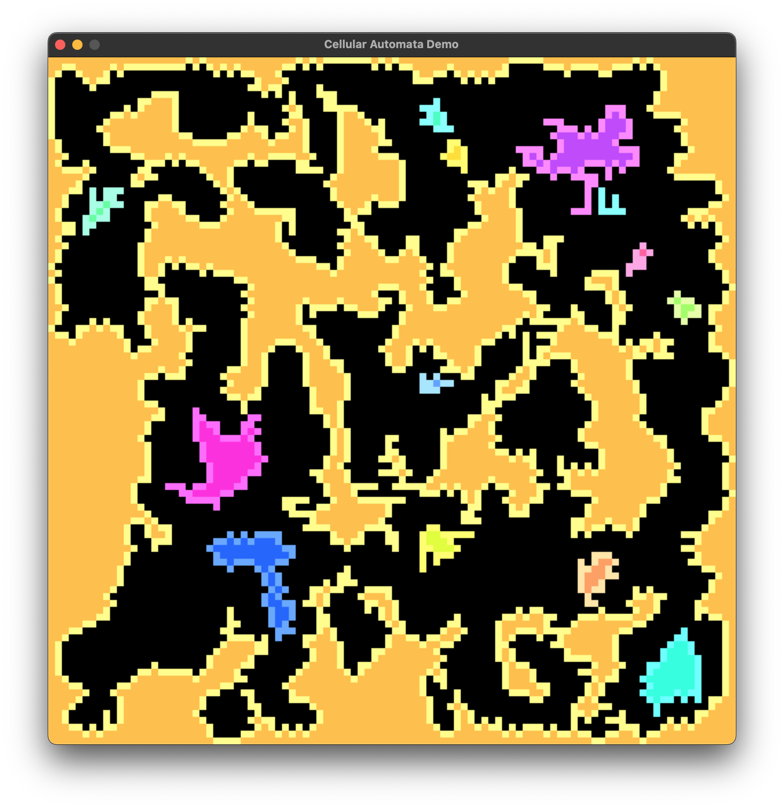

# Cellular automata

## Overview
This research project explores the generation of intricate maze structures tailored for first person shooter (FPS) game environments. Utilizing cellular automata logic, the project aims to create dynamic and challenging level maps while offering parameterization options for initial noise density and the number of iterations (generations). This customization enables researchers to fine-tune maze characteristics and study their impact on gameplay experiences.

## Getting Started
- Rust programming language
- SDL2 library with image features

## Controls
| key      | description |
| -------- | ----------- |
| q          | increase noise density  |
| a          | decrease noise density  |
| w          | increase iterations |
| s          | decrease iterations |
| n          | next iteration with current matrix  |
| r          | regenerate using current settings   |
| f          | filter small regions    |
| m          | perform full cycle maze generation  |
| esc        | exit    |
| other key  | display generator settings  |

## Example

